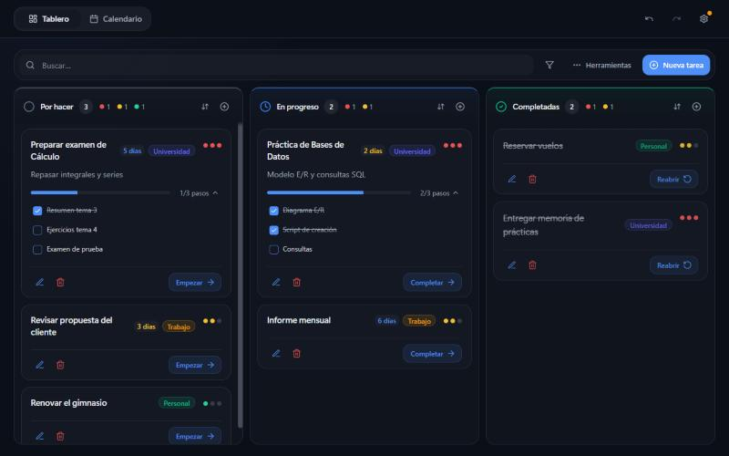

# TaskMaster

[](https://github.com/Kakauet/tasks/actions/workflows/ci.yml) [](LICENSE)

Aplicación web para gestionar tareas y eventos: tablero Kanban, calendario, etiquetas y sincronización opcional entre dispositivos. Funciona sin cuenta y guarda los datos en el propio navegador.



## Características

- **Tablero Kanban** con columnas *Por hacer*, *En progreso* y *Completadas*, arrastrar y soltar (también en móvil), orden por columna y operaciones en bloque.
- **Pasos** dentro de cada tarea para dividir el trabajo y seguir el progreso.
- **Calendario** con vistas de mes y semana, eventos de día completo, de varios días y recurrentes.
- **Eventos calificables**: marca exámenes o entregas y anota la nota.
- **Etiquetas, prioridades y fechas de vencimiento.**
- **Temporizador de foco** asociado a tareas.
- **Apariencia personalizable**: tema claro/oscuro/sistema, acentos y colores de columna.
- **Copias de seguridad**: exportación/importación JSON o gzip con vista previa, combinación y copias de recuperación.
- **Atajos de teclado** y deshacer/rehacer.
- **Sincronización opcional** con Supabase (login por email, Google o GitHub).

## Tecnologías

Next.js 14 (App Router) · React 18 · TypeScript · Tailwind CSS · shadcn/ui (Radix) · react-dnd · date-fns · Supabase · IndexedDB

## Puesta en marcha

Requisitos: Node.js 18.17 o superior.

```bash
git clone https://github.com/Kakauet/tasks.git
cd tasks
npm install
npm run dev
```

Abre [http://localhost:3000](http://localhost:3000).

### Sincronización entre dispositivos (opcional)

Sin configuración, la app funciona en modo local. Para activar login y sincronización:

1. Copia `.env.example` a `.env.local`.
2. Sigue [docs/SUPABASE_SETUP.md](docs/SUPABASE_SETUP.md) y rellena `NEXT_PUBLIC_SUPABASE_URL` y `NEXT_PUBLIC_SUPABASE_ANON_KEY`.
3. Reinicia el servidor de desarrollo.

## Scripts

| Comando | Descripción |
| --- | --- |
| `npm run dev` | Servidor de desarrollo |
| `npm run build` | Compilación de producción |
| `npm start` | Sirve la compilación de producción |
| `npm run build:dist` | Exportación estática en `dist/` para cualquier hosting estático |
| `npm run typecheck` | Comprobación de tipos con TypeScript |
| `npm run lint` | ESLint |
| `npm test` | Pruebas de regresión, datos y actividad |

## Estructura del proyecto

```
app/          Rutas, layout, estilos globales y manifest
components/   Vistas y componentes (ui/ contiene los primitivos de shadcn)
context/      Estado de tareas y autenticación
hooks/        Hooks reutilizables
lib/          Lógica de dominio, datos, apariencia y utilidades
tests/        Pruebas automatizadas (ejecutadas por npm test)
scripts/      Utilidades de compilación y comprobaciones de navegador
docs/         Documentación adicional
```

Puntos de entrada útiles:

- `components/dashboard.tsx`: navegación, cuenta y composición de las vistas.
- `components/task-board.tsx` y `components/calendar-view.tsx`: vistas de tareas y eventos.
- `context/task-context.tsx`: operaciones, historial y sincronización con Supabase.
- `lib/tasks/`: tipos, normalización, almacenamiento, recurrencias y orden de tareas, independientes de React.
- `lib/data/`: IndexedDB, copias de seguridad y registro de actividad.
- `lib/appearance.ts`: catálogo de colores y contraste; lo comparten el script previo a React y los ajustes.

### Datos

Los datos se guardan en IndexedDB y conservan las claves y el formato de exportación existentes; las instalaciones anteriores migran automáticamente desde `localStorage`. Las importaciones inválidas se rechazan completas antes de cambiar el estado, y si el almacenamiento contiene datos ilegibles se conservan en `taskmaster-state-recovery` antes de usar el estado de respaldo. Detalles en [docs/DATA_AND_ACTIVITY.md](docs/DATA_AND_ACTIVITY.md).

## Verificación

```bash
npm run typecheck
npm run lint
npm test
npm run build
```

`npm test` usa Node y el compilador TypeScript del proyecto, sin framework adicional. Estas mismas comprobaciones se ejecutan en GitHub Actions en cada push y pull request.

Los scripts `scripts/*-check.cjs`, `design-qa.cjs` y `ux-smoke.cjs` son comprobaciones de navegador con Playwright (no incluido como dependencia) que guardan capturas en `artifacts/`. Variables: `TEST_URL` (servidor a probar), `PLAYWRIGHT_MODULE` (si Playwright está instalado fuera del proyecto) y `BROWSER_CHANNEL` (por defecto `msedge`). Las llamadas a Supabase se bloquean para mantener las pruebas locales. `NEXT_BUILD_DIR` permite aislar una compilación de pruebas del directorio `.next` habitual.

## Documentación

- [docs/DESIGN.md](docs/DESIGN.md): sistema de diseño (tokens, superficies, componentes).
- [docs/DATA_AND_ACTIVITY.md](docs/DATA_AND_ACTIVITY.md): copias de seguridad, almacenamiento y registro de actividad.
- [docs/SUPABASE_SETUP.md](docs/SUPABASE_SETUP.md): autenticación y sincronización.
- [docs/DEPLOY.md](docs/DEPLOY.md): despliegue en Vercel o hosting estático.

## Licencia

[MIT](LICENSE)
